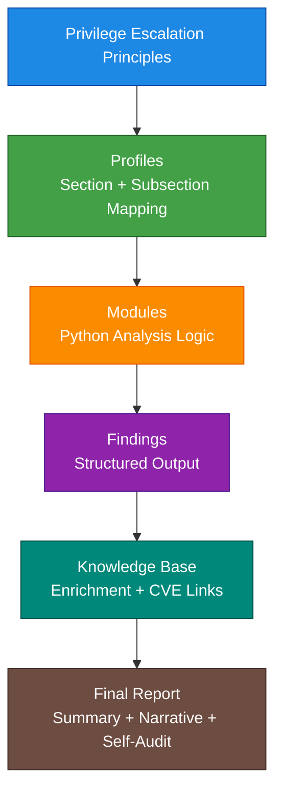

# **Privilege Escalation Principles**  
### *Independent Reference — Conceptual Model for Understanding Escalation Paths*  
*(Anchored to standard LPA categories; independent of any specific LPA output)*

---

## **Purpose**  
This document provides a **clear, plain‑language explanation** of every Privilege Escalation Principle used by LPA. It explains *why* each category matters, what assumptions each principle relies on, and how attackers exploit weaknesses in that category.  

It is designed as a **learning tool** and an **analysis aid**:  
- Learners use it to understand privilege escalation pathways.  
- Analysts use it to interpret LPA findings with clarity and confidence.  

This document is **independent of any specific LPA output**. CVEs and remediation steps tell you *what to fix*; these principles explain *why the issue is dangerous*.

---

## **Overview**  
Privilege escalation occurs when a lower‑privilege user gains access to higher‑privilege capabilities through weaknesses in system configuration, file integrity, environment control, or kernel security.  

Each principle below represents a **distinct escalation pathway**, and each pathway corresponds directly to an LPA category (SUID, sudo, cron, PATH, environment variables, capabilities, kernel exploits, systemd, NFS, containers, secrets, SGID, daemons, shared libraries, etc.).  

These principles map cleanly to the extended descriptions in the chart and form a complete conceptual model of how privilege escalation works on Linux systems.

---

## **Diagram — How Principles Flow Through LPA**  

---

# **Extended Principle Descriptions**  

### **SUID Principle**  
A SUID binary must never allow lower‑privilege users to influence its behaviour.  
Because SUID executes with the file owner’s privileges (often root), any user‑controlled input, path, environment, or writable dependency becomes a direct escalation path.

---

### **sudo Principle**  
Privilege delegation must be tightly scoped and never allow indirect command execution.  
Misconfigured sudo rules (wildcards, NOPASSWD, unrestricted interpreters) allow users to escalate by running commands that spawn shells or modify privileged files.

---

### **cron / at Principle**  
Scheduled tasks running with elevated privileges must only execute trusted, non‑writable content.  
If a root cron job calls a script or binary that a normal user can modify, the user can inject code that runs as root.

---

### **PATH Manipulation Principle**  
Privileged processes must not rely on user‑controlled search paths for command resolution.  
If a root‑run script calls `cp`, `tar`, `ls`, etc. without absolute paths, a user‑controlled `$PATH` can redirect execution to a malicious binary.

---

### **Environment Variables Principle**  
Privileged programs must not trust user‑controlled environment variables for loading code or configuration.  
Variables like `LD_PRELOAD`, `LD_LIBRARY_PATH`, or custom config/env variables can force privileged processes to load attacker‑controlled libraries or settings.

---

### **File Permissions & Ownership Principle**  
Privileged processes must not depend on files that lower‑privilege users can write to or replace.  
World‑writable or group‑writable scripts, configs, logs, or sockets used by root allow content hijacking and escalation.

---

### **Linux Capabilities Principle**  
Capabilities must be treated as partial root privileges and assigned only when strictly necessary.  
Capabilities like `CAP_SYS_ADMIN`, `CAP_SETUID`, or `CAP_NET_ADMIN` can be chained or abused to achieve full root access.

---

### **Kernel / Local Exploits Principle**  
The kernel must remain patched and within supported versions to prevent direct user‑to‑root escalation.  
Kernel vulnerabilities bypass all user‑space controls and grant root regardless of configuration.

---

### **systemd Services Principle**  
Service units running as root must not reference or execute resources writable by non‑privileged users.  
Writable `ExecStart` scripts, environment files, or included paths allow attackers to hijack service execution.

---

### **NFS / Remote Mounts Principle**  
Remote filesystems must not grant root‑equivalent write access to untrusted clients.  
Misconfigurations like `no_root_squash` allow remote users to create files that local root trusts, enabling escalation.

---

### **Containers Principle**  
Container boundaries must not expose host‑level privileged interfaces to untrusted workloads.  
Privileged containers, host mounts, or exposed Docker sockets allow attackers to escape to host root.

---

### **Passwords, Keys & Tokens Principle**  
Secrets that unlock privileged accounts must never be stored in locations accessible to lower‑privilege users.  
Readable credentials allow attackers to impersonate privileged identities directly.

---

### **Setgid (SGID) Principle**  
Group‑based delegated execution must follow the same integrity rules as SUID.  
Writable SGID directories or SGID binaries with user‑controlled behaviour allow group‑level privilege escalation.

---

### **Local Services & Daemons Principle**  
Privileged daemons must validate input strictly and avoid executing user‑controlled content.  
Insecure IPC, command injection, or plugin loading in root‑run services can be exploited for escalation.

---

### **Shared Libraries & Plugins Principle**  
Privileged programs must only load libraries and plugins from trusted, non‑writable locations.  
If an attacker can place or replace a library in a search path used by a privileged binary, they can hijack execution.

---

## **How This Chart Is Meant to Be Used**  
- **Independent reference:** It stands alone and does not depend on any specific LPA output.  
- **Anchor for non‑technical readers:** Each label is a familiar LPA category; each principle is a plain‑language explanation.  
- **CVE alignment:**  
  - CVEs provide specific remediation steps.  
  - This chart provides the conceptual reason the issue matters.  
- **Together:** They form a complete narrative for analysis and reporting.

---
